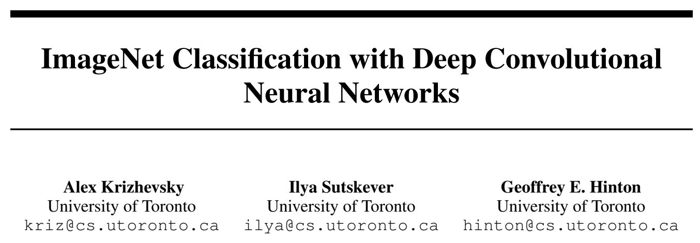
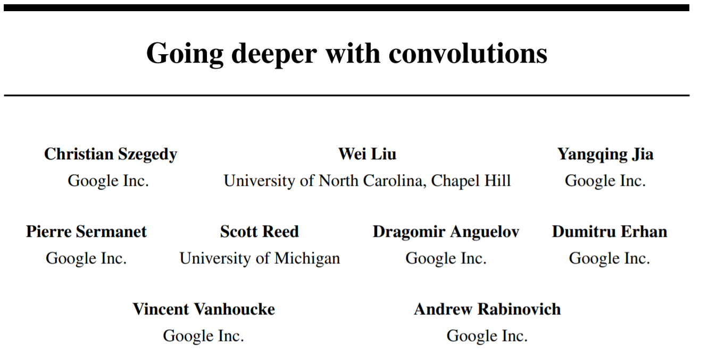

# 深度学习论文阅读
对已经读过的论文和将要读的论文进行梳理，以便自己总结。

## 经典分类网络
| 发表时间 | 标题 | 图片 | 贡献 |
| :--: | -- | -- | -- | -- | -- |
| 2012 |[AlexNet](https://papers.nips.cc/paper/2012/file/c399862d3b9d6b76c8436e924a68c45b-Paper.pdf)|  | 深度学习的开篇之作 |
|  |[ZFNet]()  | |
| 2014 |[VGGNet](https://arxiv.org/pdf/1409.1556.pdf) |  | |
| 2014 |[GoogLeNet(Inception V1)](https://arxiv.org/pdf/1409.4842.pdf) |  | |
|  |[Inception V2]() | |
|  |[Inception V3]() | |
| 2015 |[ResNet](https://arxiv.org/pdf/1512.03385.pdf) |  ||
|  |[ResNext]() | |
## 目标检测
| 发表时间 | 标题 | 贡献 |
| -- | -- | -- |
|   |[R-CNN](https://arxiv.org/pdf/1311.2524v5.pdf) |  | |
|   |[Fast R-CNN](https://arxiv.org/pdf/1504.08083v2.pdf) |  | |
|   |[Faster R-CNN](https://arxiv.org/pdf/1506.01497v3.pdf) |  |
|   |[YOLO](https://arxiv.org/pdf/1506.02640v5.pdf) |  |
|   |[YOLO V2](https://arxiv.org/pdf/1612.08242v1.pdf) |  |
|   |[YOLO V3](https://arxiv.org/pdf/1804.02767v1.pdf) |  |
|   |[YOLO V4]() | |
|   |[SSD](https://arxiv.org/pdf/1512.02325v5.pdf) |  |
|   |[RetianNet]() | |
## 语义分割

## 重识别

## 其它

