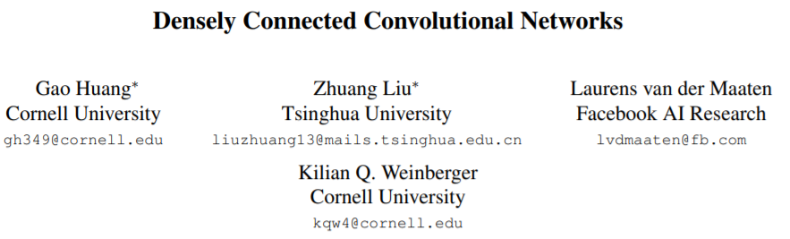
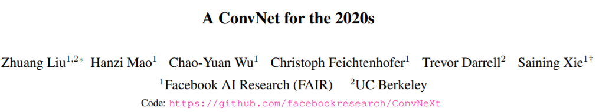
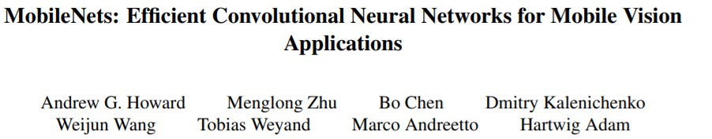
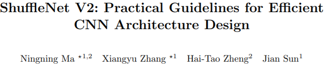
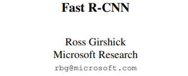

# 深度学习论文阅读
对已经读过的论文和将要读的论文进行梳理，以便自己总结。

## 计算机视觉

### 经典分类网络
| 完成 | 发表时间 | 标题 | 封面 | 贡献 |
| -- | -- | -- | -- | -- |
| ✅ | 2012 |[AlexNet](https://papers.nips.cc/paper/2012/file/c399862d3b9d6b76c8436e924a68c45b-Paper.pdf)|   | 深度学习的开篇之作，第一次将深度学习技术引入图像分类中。在ImageNet分类竞赛中远远领先第二名。使用了两块显卡训练，隐式地使用了分组卷积，第一次提出了一些概念(多GPU，分组卷积，最大池化，ReLU，Dropout)，奠定了现代卷积网络的架构。|
| ✅ | 2013 |[ZFNet](https://arxiv.org/pdf/1311.2901v3.pdf) |  | 最大的亮点是利用反卷积可视化技术对卷积核可视化，将特征映射到输入像素空间，增加了网络的可解释性；特征存在层次性，层次越深，特征更具有全局信息，不变性越强。|
| ✅ | 2014 |[VGGNet](https://arxiv.org/pdf/1409.1556.pdf) |  |搭建了一个更深的网络，提出了使用多个小卷积核能够与大卷积核获得相同的感受野，同时能够显著减少参数量。提出了卷积 Block 的概念，通道呈二进制的增加(更能利用计算资源) |
| ✅ | 2014 |[GoogLeNet(Inception V1)](https://arxiv.org/pdf/1409.4842.pdf) |  | 提出了在同一层利用多个不同尺度的卷积提取特征，再将得到的特征拼接起来传入下一层作为输入 |
| ✅ | 2015 |[Inception V2-V3](https://arxiv.org/pdf/1512.00567.pdf) |  | 将大卷积核分解成几个小卷积核；非对称卷积；标签平滑策略 |
| ✅ | 2015 |[ResNet](https://arxiv.org/pdf/1512.03385.pdf) |  | 提出了残差结构，解决了卷积网络无限堆叠卷积层产生的性能退化问题。使用残差链接能够很好的将深层的 loss 传至浅层，解决了因为链式法则带来的梯度弥散问题。 |
| ✅ | 2016 | [Inception V4](https://arxiv.org/pdf/1602.07261.pdf) |  | 将 residual 与 inception 结合起来；带残差的 inception 训练速度更快。|
| ✅ | 2016 | [DenseNet](https://arxiv.org/pdf/1608.06993v5.pdf) |  | 在残差连接时，进行通道的 Concatenat 而不是进行简单的相加 |
| ✅ | 2016 | [Xception](https://arxiv.org/pdf/1610.02357v3.pdf) |  | 在之前模型基础上使用 depthwise separable 替换传统卷积 |
| ✅ | 2017 |[ResNext](https://arxiv.org/pdf/1611.05431.pdf) |  | 在 ResNet基础上引入 split-transform-merge 结构(等价于分组卷积)，同时使用 module block，使用更少的超参数；在相同参数量的情况下，ResNext 可以使用更大的通道，获得更多的特征图。|
| | 2017 | [SENet](https://arxiv.org/abs/1709.01507v4) |  | 提出了 SE block(使用 chanel attention)，使其能更加关注感兴趣、有用的通道特征；可以直接在以前的经典网络中添加 SE blocks；做了很多消融实验验证其有效性 |
| | 2020 | [ViT](https://arxiv.org/pdf/2010.11929v2.pdf) |  | |
| | 2021 | [ConvNext](https://arxiv.org/pdf/2201.03545v1.pdf) |  | |

### 轻量化网络
| 完成 | 发表时间 | 标题 | 封面 |贡献 |
| -- | -- | -- | -- | -- |
| | 2016 | [SqueezeNet](https://arxiv.org/pdf/1602.07360.pdf) |  | 用 1 * 1 卷积取代 3 * 3 卷积；减少 3 * 3 卷积的输入通道数；将下采样层尽量后置，使得特征图更大，具有更多的特征 |
| ✅ | 2017 | [MobileNet](https://arxiv.org/pdf/1704.04861.pdf) |  | 使用深度可分离卷积搭建轻量化网络 |
| ✅ | 2018 | [MobileNet V2](https://arxiv.org/pdf/1801.04381.pdf) |  | 使用深度可分离卷积；Linear Bottlenecks；Inverted residuals |
| ✅ | 2017 | [ShuffleNet](https://arxiv.org/pdf/1707.01083v2.pdf) |  | 使用了分组卷积和通道 shuffle，减少参数量的同时保证了精度 |
| ✅ | 2018 | [ShuffleNet V2](https://arxiv.org/pdf/1807.11164v1.pdf) |  | |
| | 2019 | [MobileNet V3](https://arxiv.org/pdf/1905.02244.pdf) |  | |
| | 2019 | [EfficentNet](https://arxiv.org/pdf/1905.11946v5.pdf) |  | |

### 目标检测
| 完成 | 发表时间 | 标题 | 封面 |贡献 |
| -- | -- | -- | -- | -- |
| ✅ | 2013 |[R-CNN](https://arxiv.org/pdf/1311.2524v5.pdf) |  | 深度学习目标检测经典开山之作。提出Reigon Proposal；使用CNN提取特征；提出 fine-tuning 策略 |
| ✅ | 2014 |[SPPNet](https://arxiv.org/pdf/1406.4729v4.pdf) |  | 空间金字塔池化；共享卷积网络提取的特征 |
| ✅ | 2015 |[Fast R-CNN](https://arxiv.org/pdf/1504.08083v2.pdf) |  | 采用共享卷积特征；RoI pooling；multi-task loss；网络各组件联合训练 |
| ✅ | 2015 |[Faster R-CNN](https://arxiv.org/pdf/1506.01497v3.pdf) |  | 提出 RPN，进一步降低检测时间；使用 anchors 生成先验框 |
| ✅ | 2015 |[YOLO](https://arxiv.org/pdf/1506.02640v5.pdf) |  | one stage 目标检测经典之作，将目标检测变成一个回归问题。模型直接端到端训练，达到了实时目标检测水平，同时也保持了较高的性能|
| ✅ | 2015 |[SSD](https://arxiv.org/pdf/1512.02325v5.pdf) |  | 使用多尺度特征进行检测，使用不同卷积层的特征进行检测 |
| ✅ | 2016 |[YOLO V2](https://arxiv.org/pdf/1612.08242v1.pdf) |  | 在 yolov1 的基础引入了 anchors 同时使用聚类的策略得到先验 anchors 以提高对小目标的识别；融合不同尺度特征；|
| ✅ | 2016 |[YOLO V2](https://arxiv.org/pdf/1612.08242v1.pdf) |  | 在 yolov1 的基础引入了 anchors 同时使用聚类的策略得到先验 anchors 以提高对小目标的识别；融合不同尺度特征；|
| ✅ | 2017 |[RetianNet](https://arxiv.org/pdf/1708.02002.pdf) |  | 提出 focal loss，强调难例的损失，使模型训练时更注重难例；使用了 FPN 网络进行特征融合|
| | 2017 |[Cascade R-CNN](https://arxiv.org/pdf/1712.00726v1.pdf) |  | |
| ✅ | 2018 |[YOLO V3](https://arxiv.org/pdf/1804.02767v1.pdf) |  | |
| ✅ | 2020 |[YOLO V4](https://arxiv.org/pdf/2004.10934.pdf) |  | 对各种 Backbone 和 Tricks 进行梳理和实验，试验了当时所有的 Tricks。 | 
| | 2021 | [Swin Transformer](https://arxiv.org/pdf/2103.14030v2.pdf) |  | |

### 语义分割
| 完成 | 发表时间 | 标题 | 封面 |贡献 |
| -- | -- | -- | -- | -- |
| | 2014 | [FCN](https://arxiv.org/pdf/1411.4038.pdf) |  | |
| | 2014 | [DeepLab V1](https://arxiv.org/pdf/1412.7062.pdf) |  | |
| | 2015 | [U-Net](https://arxiv.org/pdf/1505.04597.pdf) |  | |
| | 2015 | [DeconvNet](https://arxiv.org/pdf/1505.04366.pdf) |  | |
| | 2015 | [SegNet](https://arxiv.org/pdf/1511.00561.pdf) |  | |
| | 2016 | [DeepLabV2](https://arxiv.org/pdf/1606.00915.pdf) |  | |
| | 2017 |[Mask R-CNN](https://arxiv.org/pdf/1703.06870v3.pdf) |  | |
| | 2017 | [DeepLabV3](https://arxiv.org/pdf/1706.05587.pdf) |  | |
| | 2018 | [DeepLabV4](https://arxiv.org/pdf/1802.02611.pdf) |  | |

### 深度学习使用的 Tricks
| 完成 | 发表时间 | 标题 | 封面 |贡献 |
| -- | -- | -- | -- | -- |
| | 2015 | [Batch Normalization](https://arxiv.org/pdf/1502.03167.pdf) |  | |

### 重识别
| 完成 | 发表时间 | 标题 | 封面 |贡献 |
| -- | -- | -- | -- | -- |

### 其它
| 完成 | 发表时间 | 标题 | 封面 |贡献 |
| -- | -- | -- | -- | -- |

## 自然语言处理